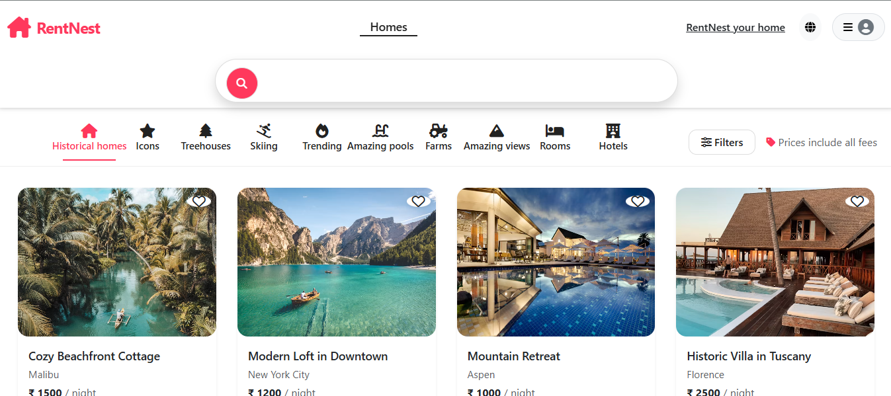
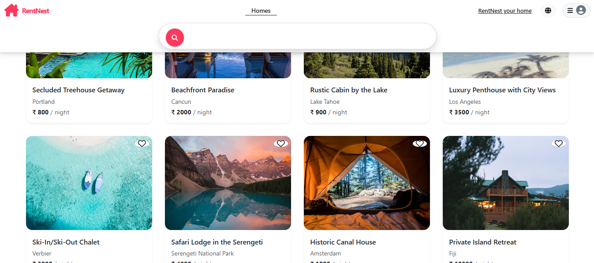
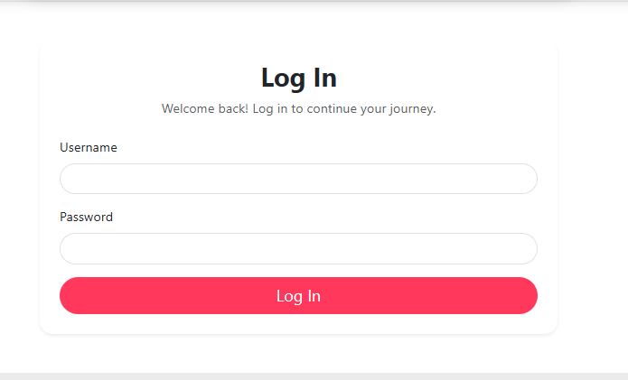

<div align="center">

# 🏡 RentNest — Hotel Booking Platform

### A modern full-stack platform to discover, book, and manage hotel & rental properties online.

[](https://rent-nest-7eri.vercel.app/listings)
[](https://github.com/AhmedShehzad12/Rent-Nest)
[](#-license)
[](#-contributing)

</div>

---

## 📖 **About the Project**

**RentNest** is a full-stack web application that allows users to **discover, view, and book hotels** or rental properties online. It provides a clean, user-friendly interface for browsing properties, managing bookings, and listing new properties.

Built using **Node.js + Express + MongoDB** with a **server-side rendered (EJS)** frontend, RentNest offers a seamless experience for both property owners and travelers.

---

## 🚀 **Live Demo**

| Service | URL |
|---------|-----|
| 🌐 **Live Application** | [rent-nest-7eri.vercel.app](https://rent-nest-7eri.vercel.app/listings) |
| 📦 **Source Code** | [github.com/Mahfooj12/RentNest](https://github.com/Mahfooj12/RentNest) |

> 💡 **Note:** The app is hosted on Vercel. The first request may take a few seconds if the server is cold-starting.

---

## ✨ **Features**

<table>
  <tr>
    <td width="50%">

### 👤 User Features
- 🔐 Register & login securely
- 🏨 Browse available properties
- 🔎 Search & filter listings
- 📄 View detailed property info
- 📅 Book properties instantly
- 🏠 Add & manage your own listings

    </td>
    <td width="50%">

### ⚙️ Technical Features
- 🔒 Session-based authentication
- 🗄️ MongoDB database integration
- 📱 Fully responsive design
- ⚡ Fast server-side rendering (EJS)
- 🎨 Bootstrap-powered clean UI
- 🛡️ Input validation & error handling

    </td>
  </tr>
</table>

---

## 🛠️ **Tech Stack**

<table>
  <tr>
    <th>Category</th>
    <th>Technology</th>
  </tr>
  <tr>
    <td>🎨 <b>Frontend</b></td>
    <td>
      
      
      
      
      
    </td>
  </tr>
  <tr>
    <td>🔙 <b>Backend</b></td>
    <td>
      
      
    </td>
  </tr>
  <tr>
    <td>🗄️ <b>Database</b></td>
    <td>
      
      
    </td>
  </tr>
  <tr>
    <td>🧰 <b>Tools</b></td>
    <td>
      
      
      
      
    </td>
  </tr>
  <tr>
    <td>☁️ <b>Deployment</b></td>
    <td>
      
      
    </td>
  </tr>
</table>

---

## 📂 **Project Structure**

```text
RentNest/
│
├── public/                    # Static assets
│   ├── css/                   # Stylesheets
│   ├── js/                    # Client-side scripts
│   └── images/                # Image assets
│
├── views/                     # EJS templates
│   ├── layouts/               # Boilerplate layouts
│   ├── listings/              # Property listing pages
│   ├── users/                 # Auth pages
│   └── partials/              # Reusable components (navbar, footer)
│
├── models/                    # Mongoose schemas
│   ├── user.js                # User model
│   ├── listing.js             # Property/listing model
│   └── ...
│
├── routes/                    # Express routes
│   ├── listings.js            # Listing routes
│   ├── users.js               # Auth routes
│   └── ...
│
├── controllers/               # Business logic
│   └── ...
│
├── utils/                     # Utility functions
│   └── ...
│
├── app.js                     # Main Express app
├── package.json
├── package-lock.json
├── .env                       # Environment variables (not committed)
├── .gitignore
└── README.md
```

---

## ⚙️ **Getting Started**

### **Prerequisites**

Make sure you have the following installed:

- 
- 
- 
- 

### **1️⃣ Clone the Repository**

```bash
git clone https://github.com/Mahfooj12/RentNest.git
cd RentNest
```

### **2️⃣ Install Dependencies**

```bash
npm install
```

### **3️⃣ Configure Environment Variables**

Create a `.env` file in the root directory:

```env
MONGO_URL=your_mongodb_connection_string
SESSION_SECRET=your_session_secret
PORT=3000
```

> ⚠️ **Important:** Never commit the `.env` file to GitHub. Make sure it's listed in `.gitignore`.

### **4️⃣ Run the Application**

**Development mode (with Nodemon):**

```bash
npx nodemon app.js
```

**Or production mode:**

```bash
npm start
```

The app will be running at:

```
http://localhost:3000
```

---

## 🔐 **Environment Variables**

Your `.env` file should contain:

| Variable | Description |
|----------|-------------|
| `MONGO_URL` | MongoDB connection string (local or Atlas) |
| `SESSION_SECRET` | Secret key for session management |
| `PORT` | Server port (default: 3000) |

**Your `.gitignore` must include:**

```text
node_modules/
.env
```

---

## 📸 **Screenshots**

<div align="center">

### 🏠 Home Page


### 🏨 Property Detail Page


### 🔐 Login Page


</div>

> 💡 **Tip:** Add your screenshots in a `screenshots/` folder at the root of the project.

---

## 🌟 **Future Improvements**

- 💳 **Online Payment Integration** — Stripe/Razorpay for booking payments
- ⭐ **Ratings & Reviews** — Let users rate properties and leave reviews
- 🔔 **Booking Notifications** — Email/SMS alerts for confirmed bookings
- 🗺️ **Map Integration** — Show property locations on interactive maps
- ❤️ **Wishlist** — Save favorite properties for later
- 📊 **Admin Dashboard** — Analytics, booking management, user insights
- 📧 **Email Confirmation** — Automated booking confirmation emails
- 📱 **Mobile App** — Native iOS/Android version
- 🌐 **Multi-language Support** — i18n for global reach
- 🔍 **Advanced Filters** — Price range, amenities, ratings

---

## 🤝 **Contributing**

Contributions are welcome! Here's how you can help:

1. Fork the repository
2. Create a feature branch (`git checkout -b feature/AmazingFeature`)
3. Commit your changes (`git commit -m 'Add some AmazingFeature'`)
4. Push to the branch (`git push origin feature/AmazingFeature`)
5. Open a Pull Request

---

## 📄 **License**

This project is created for **educational and portfolio purposes**. Feel free to use it as a learning reference.

---

## 👨‍💻 **Author**

<div align="center">

**Ahmed Shehzad**

🎓 Computer Science & Engineering (Artificial Intelligence)

[](https://github.com/AhmedShehzad12)
[](https://www.linkedin.com/in/ahmed-shehzad-2a8b78219/)

</div>

---

<div align="center">

### ⭐ **If you like this project, please give it a star!** ⭐

Made with ❤️ using Node.js, Express & MongoDB


</div>
